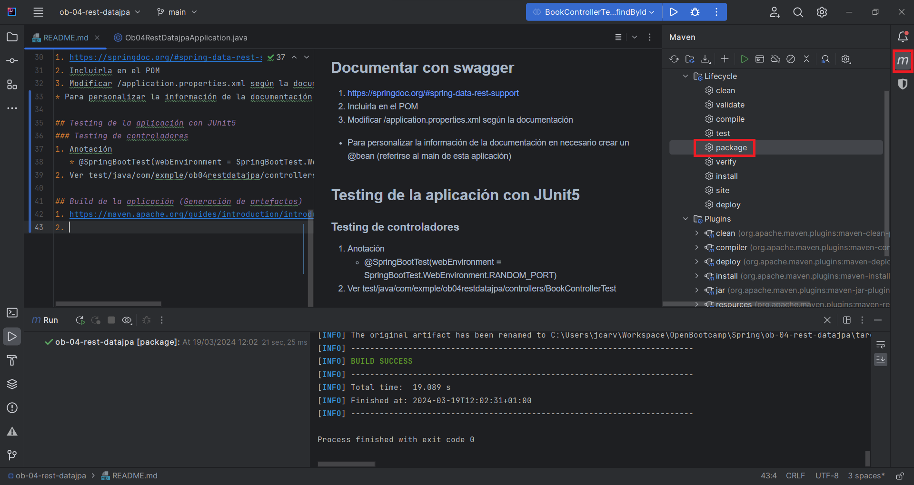

## Spring Boot
Proyecto Spring Boot con las dependencias / starters:
Starters para persistencia:
* H2
* Spring Data JPA

Starters para Web:
* Spring Web
* Sring Boot Dev tools

Aplicación API REST con accesos a base de datos H2 para persistir la información

El acceso se puede realizar dede Postman o Navegador

## Entidad Book
1. Book
2. BookRepository
3. BookController
   * Endpoints

## Configurar SpringBoot DevTools

1. Agregar SpringBoot Dev tools como dependencia
2. File > Settings > Advance Settings > Compiler
   * Check "Allow auto-make to start even if developed application is currently running"
3. File > Settings > Build, Execution, Deployment > Compiler
   * Check "Build project automatically"

## Documentar con swagger
1. https://springdoc.org/#spring-data-rest-support
2. Incluirla en el POM
3. Modificar /application.properties según la documentación
* Para personalizar la información de la documentación en necesario crear un @bean (referirse al main de esta aplicación)

## Testing de la aplicación con JUnit5
### Testing de controladores
1. Anotación 
   * @SpringBootTest(webEnvironment = SpringBootTest.WebEnvironment.RANDOM_PORT)
2. Ver test/java/com/exmple/ob04restdatajpa/controllers/BookControllerTest

## Build de la aplicación (Generación de artefactos)
1. https://maven.apache.org/guides/introduction/introduction-to-the-lifecycle.html
2. Creando el artefacto

3. Artefacto .jar en carpeta target
4. java -jar target/application-name.jar

### Perfiles de configuración
1. Creando variables de configuración (application.properties)
   * application.properties -> app.message=Hola Mundo
   * Con la anotación @Value("${app.message}") String message (ver HelloController)

## Deploy a Heroku
